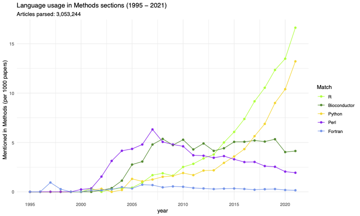

# Parsing Pubmed: R vs. Python

The R v. Py debate is wide-ranging - from performance to packages to preference - but I've always wanted to ask what the **biomedical literature *actually* says** over time.

This collection of scripts was my stab at analyzing and visualizing that, which I started sometime mid-pandemic (2021-ish?).  Specifically, the R scripts in do the following:

1. Gather scientific articles from [PMC's Open Access Subset](https://www.ncbi.nlm.nih.gov/pmc/tools/openftlist/) as XML
2. Extract the text for the methods section
3. Use regular expressions to detect mentions of R, Python, and other languages

I was never able to work out the error-handling well enough to parse millions of methods sections perfectly, but I was able to churn through about 3 of 4+ million PMC articles available by early 2022.

## Results for 1995-2021

    

## Overlaps between languages
I was also interested in looking at how often these languages are mentioned together, so [here's a PDF](plots/0/combined_plots.new.pdf) with more detailed plots, as well as a table with links to papers that I used to spot-check articles with multiple languages.

<object data="plots/0/combined_plots.new.pdf" type="application/pdf" width="100%"> 

